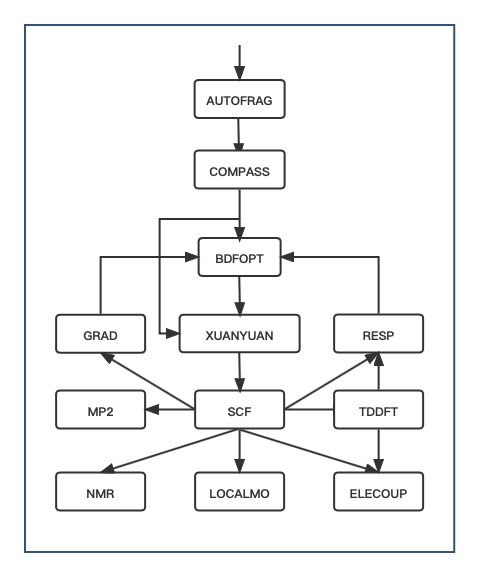

Input and output formats
************************************

Input format of BDF
==========================================================================

There are three types of BDF input file formats: easy input, advanced input, and mixed input. **Easy input** is easy to use and does not require the user to know much about the details of the calculation, which is a low threshold for beginners. **Advanced input** provides powerful control over BDF calculations, with precise control over each calculation module. **Mixed input** of BDF is a way to add some advanced computational functions to the BDF simple input and add fields that precisely control the behavior of BDF computational modules as defined by the advanced input format, while keeping the BDF simple input convenient and beginner-friendly. In short, BDF hybrid input is a combination of BDF simple input and advanced input. For beginners, most computational tasks can be accomplished using only BDF simple inputs. For users who have a basic understanding of quantum chemistry theory and want to learn and use the more advanced features of BDF in depth, they can learn to use the advanced input of BDF.

.. note::

   *Inputs other than **file names** , **shell** commands and **environment variable names** , such as BDF **module names** , **keywords** and **keyword values** , are not case sensitive. 
   

..

Easy input for BDF
--------------------------------------------------------------------------

The BDF simple input format is described in detail using the single-point energy calculation of water molecules as an example：

.. code-block:: bdf

  #!H2O.bdf
  B3lyp/3-21G 

  Geometry  # Enter atomic coordinates, in unit Angstrom
  O 0.00000    0.00000    0.36827
  H 0.00000   -0.78398   -0.18468
  H 0.00000    0.78398   -0.18468
  End Geometry

The BDF easy input consists of 3 input blocks:

**First input block** 

The first input block is a single line, starting with ``#!`` followed by the name of the input script, e.g. ``#!name.bdf`` , which can be a description text.

**Second input block** 

starts with the second line and ends with the line before ``Geometry`` . This input block, which can consist of multiple lines, is the command control line of the BDF, and is used to specify what computational tasks the BDF does. It can consist of multiple lines, and can be used to specify some basic computational control parameters such as basis group, generalization, charge number and spin multiplicity. The content of the command line is separated by spaces for the different keywords. The keywords and their values are separated by equal signs. A keyword without a value is itself a control keyword. Keywords can have one value or multiple values separated by commas. Keywords can have multiple lines. If ``#`` appears in a line, the line after ``#`` is a comment statement.

**Third input block** 

Starting from the ``Geometry`` line and ending at the ``End Geometry`` line, enter the geometry of the molecule, as described in the input format of the molecular structure.

.. tip:: 

  * The third line in this example is an empty line, a blank line in the BDF input, except between the defined molecular coordinates ``Geometry ... End geometry`` , all other blank lines are non-essential, but for readability, it is strongly recommended that users use blank lines to separate different input blocks and different modules.

 Advanced input for BDF
--------------------------------------------------------------------------

The BDF advanced input is the input mode set during the initial development of the BDF and is characterized by **module-guided computation + module parameter control** in the following format

.. code-block:: bdf

    $bdfmodule1
    # Comment
    Keyword1
      value # inline comment
    Keyword2
      value
      ...
    $end

    %cp $BDFTASK.scforb $BDF_TMPDIR/$BDFTASK.inporb 
    $bdfmodule2
    Keyword1
      value
    Keyword2
      value
      ...
    $end

The description is as follows.
  - This input contains two BDF computation modules, ``bdfmodule1`` and ``bdfmodule2`` (this is only an example, there are not really modules named ``bdfmodule1`` and ``bdfmodule2`` 的模块). A computation task may contain more than one BDF module. 
  - **Module-directed computation**: means that two computation modules are executed sequentially to complete the computation. The input to each module starts with ``$bdfmodule`` and ends with the first subsequent occurrence of the ``$end`` keyword, and between ``$bdfmodule`` and ``$end`` are the control keywords and their values for that module. where  ``bdfmodule`` is the name of the BDF calculation module, such as ``COMPASS`` , ``XUANYUAN`` , ``SCF`` , etc.
  - **BDF module parameter control**: Each module controls its computation behavior by its own keywords, and the parameter control input uses the **keyword + value** , where the keyword value starts from the next line of the line where the keyword is located, and can be a single line or multiple lines depending on the specific keyword.

The advanced input format of BDF requires a certain understanding of quantum chemical theory and the specific functions of each calculation module of BDF. **bdfdrv.py** written in python language, calls different calculation modules sequentially to complete complex calculation tasks. to complete the complex computational tasks, each module through the temporary files and environment variables to exchange data between.

Here, we take water molecules as an example to describe in detail the BDF advanced input format.

.. code-block:: bdf

  #Example for BDF advanced input
  $compass
  Title
   Water molecule, energy calculation
  Geometry
  O 0.00000    0.00000   0.36827
  H 0.00000   -0.78398   -0.18468
  H 0.00000    0.78398   -0.18468
  End geometry
  Basis # basis sets 
   3-21G
  Group # C2v point groups, which can be entered without input, are automatically judged by the program, and are often used to specify D2h and its subgroup calculations for higher-order groups.
   C(2v)
  $end

  $xuanyuan
  $end

  $scf
  RHF # restricted Hatree-Fock
  $end

  %cp $BDF_WORKDIR/$BDFTASK.scforb $BDF_TMPDIR/$BDFTASK.inporb
  $scf
  RKS # restricted Kohn-Sham
  DFT
   B3lyp     # B3LYP functional， Notice， it is different with B3lyp in Gaussian. 
  Guess 
   Readmo    # Read orbital from inporb as the initial guess orbital
  $end

The input file shown above contains four computational modules, **COMPASS**、 **XUANYUAN** and two **SCF** . **COMPASS** is used to read in the input molecular coordinates, basis functions and other information, and store them as data structures inside BDF. An important task of **COMPASS** is the processing of molecular point groups, including the determination of molecular symmetry and the generation of symmetry-adapted orbitals. **XUANYUAN** is used to calculate single and double electron integrals. The **SCF**  module is then called twice to perform self-consistent field calculations, once for the RHF (Restricted Hatree-Fock) and RKS (Restricted Kohn-Sham).

The input to each computation module follows the **“keyword + value”** format, i.e., a keyword, such as ``Group`` in **COMPASS** , is given followed by a value for that keyword, in this case ``C(2v)``。. Some keywords are used for logical control, such as  ``RHF`` in the first **SCF** module, which specifies that the **SCF** module performs the  ``RHF`` calculation, and no additional input values are needed for such keywords. Some of the keywords require multiple lines of input, as described in the keyword descriptions for each module.

Between the first and second  **SCF**  module, there is a line starting with  ``%`` . Here, we insert a shell command that performs a task of copying a file. The **$BDFTASK.scforb** file generated by the first  **SCF**  calculation and placed in **BDF_WORKDIR** is copied to **BDF_TMPDIR** and renamed to **$BDFTASK.inporb** . In the second  **SCF**  module, we specify the keyword ``guess`` , with the value ``readmo``, i.e., read in the molecular orbitals as an initial guess. In the BDF advanced input, the lines starting with ``%`` are shell command lines. The lines starting with  ``#``  or containing  ``#``  in the input, all the contents after the  ``#``  are comment statements.

The **following flowchart of BDF modules and calculations** gives the order in which each module is called.

.. _BDFpromodules:

   the BDF module and calculation flow diagram

.. tip::

  - A complete computational task requires multiple calls to the BDF computational modules. The order in which the modules appear in the advanced input is given by **the BDF module and calculation flow diagram** . The general calculation task will only involve a small part of the module shown in the figure above, for example, most calculation tasks do not require the ``AUTOFRAG`` module, and the first calculation module is actually ``COMPASS`` ; Only for **iOI-SCF** and **FLMO** calculations should the ``AUTOFRAG`` module appear (and be placed before ``COMPASS`` ) to automatically slice the numerator, and then ``COMPASS`` and other computational modules should be called to finish the job.
  - For example, if the **molecular structure is optimized** by the Kohn-Sham method, the ``COMPASS`` module preprocesses the molecular structure and the basis group, and then the ``BDFOPT`` module calls the ``XUANYUAN->SCF->RESP`` modules several times in sequence to optimize the molecular structure by calculating the single electron integral, the self-consistent field energy and the gradient of energy to the nucleus coordinates.
  - For the actual calculation, the concise input file of the BDF is translated into the advanced input format of the BDF and stored in a hidden file  **.bdfinput**  in a temporary folder specified by **BDF_ΤΜPDIR** .

The following **BDF modules and menus** give the names and functions of the BDF modules.

.. table:: BDF Module and menu
    :widths: auto

    ============== ==================================================================================
      Module name          Function 
    ============== ==================================================================================
       AUTOFRAG      Automatic molecular fragmentation, driving IOI-SCF and flmo calculations
       COMPASS       Molecular structure, basis set and symmetry pretreatment 
       XUANYUAN      Atomic orbital integral
       BDFOPT        Molecular geometry optimization
       SCF           Hartree-Fock and Kohn sham self consistent fields
       TDDFT         Time dependent density functional calculation
       RESP          Hartree-Fock, Kohn sham and TDDFT gradients
       GRAD          Hartree-Fock gradients
       LOCALMO       Molecular orbital localization
       NMR           Calculation of nuclear magnetic shielding constant
       ELECOUP       Electron transfer integral, energy transfer integral, localized excited state
       MP2           Møller-Plesset second-order perturbation theory
    ============== ==================================================================================

.. table:: BDF advanced input description table
    :widths: auto

    ===================== ================================================================================================================================================================================================================================
       Input               Description
    ===================== ================================================================================================================================================================================================================================
     $modulename...$end    modulename is the control input for the BDF calculation module, all modulenames are available in the $BDFHOME/database/program.dat file
     #                    Lines starting with # or following # in each line are comment statements
     \*                   \* is placed at the beginning of the line only, and the lines starting with * are commented out
     %                     The lines starting with % and ending with % are shell commands, usually used to process intermediate files
     &database...&end      Some complex calculations, such as FLMO, require information such as the definition of molecular fragments, which is usually placed between &database and &end. Please refer to :ref:`test062<test062>` 
    ===================== ================================================================================================================================================================================================================================

Mixed input for BDF
--------------------------------------------------------------------------

Mixed input combines the simplicity of BDF input with the advanced input format, providing the convenience of BDF simple input and the precise control of BDF computational modules, which is useful when performing complex computations.。

The basic structure of a BDF Mixed input file is as follows：

.. code-block:: bdf

  #!name.bdf
  Method/functional/basis sets Keyword Keyword = option Keyword = option 1, option 2
  Keywords = Options

  Geometry
  Molecular structure information
  End Geometry 

  $modulename1
  ...       # Comment statements
  $End

  $modulename2
  ...
  $End

A mixed input file can be divided into 4 input blocks,  **the first three of which are formatted for the simple input mode of BDF** and the fourth input block, which is what remains after ``End geometry`` , is in the same format as the advanced BDF input and is used to provide precise control over the behavior of specific BDF calculation modules, and these parameters are added to the corresponding BDF calculation modules with the highest control priority.

The BDF hybrid input format is described in detail using the cation of water as an example.

.. code-block:: bdf

  #!H2O+.bdf
  B3lyp/3-21G iroot=4 

  Geometry
  O 0.00000    0.00000   0.36827
  H 0.00000   -0.78398   -0.18468
  H 0.00000    0.78398   -0.18468
  End Geometry

  $scf
  Charge # Specify the charge number as +1
   1
  molden # Export molecular tracks as molden format files
  $end

The above example adds a line starting with ``$scf`` and ending with ``$end`` to control the **SCF** module, in addition to the required BDF simple input. This input is a mix of BDF simple and advanced inputs, and in the input of the **SCF** module, with the keyword ``charge`` set to ``1`` for calculating  :math:`\ce{H2O+}`  ions and the ``molden`` keyword controlling the output of the converged SCF track to a  **molden**  format file, can be used to visualize molecular structure, orbitals, electron density, analyze wave functions, or calculate single-electron properties. It should be noted that in the second command line of the hybrid input format,  ``charge = -1`` can be used to control the calculation of  :math:`\ce{H2O+}`  anions, but if the  ``charge``  keyword is also used in the later input of the scf module, the latter has the highest control priority and will override the input in the command line. In other words, in the mixed input format, the advanced input keyword for each BDF calculation module has the highest control priority.

Input format of molecular structure
==========================================================================

The molecular structure input of BDF starts from ``Geometry`` and ends at ``End geometry`` , and can be entered in three ways: Cartesian, Internal, or specified xyz file format.

.. Warning::
    The default unit for BDF input coordinates is Å. If you need to enter the molecular structure in atomic units, you need to use the keyword ``unit=Bohr`` . In BDF's simple input mode, ``unit=Bohr`` is placed in the second control line. In case of advanced input mode Use the keyword ``unit`` in the Compass module and specify the value as Bohr, see the example below.
    
Specify the molecular coordinate units in the control line of the concise input, and enter a bond length of 1.50 Bohr for the :math:`\ce{H2}` molecule.

.. code-block:: bdf

  #! bdftest.sh
  HF/3-21G unit=Bohr

  Geometry
    H  0.00 0.00 0.00
    H  0.00 0.00 1.50
  End geometry

In the advanced input mode, control the molecular coordinate units

.. code-block:: bdf

  $compass
  Geometry
    H  0.00 0.00 0.00
    H  0.00 0.00 1.50
  End geometry
  Basis
    3-21G
  Unit
    Bohr
  $end
  
Input of Cartesian Coordinate Format for Molecular Structure
--------------------------------------------------------------------------

.. code-block:: bdf

   Geometry # default coodinate unit is angstrom 
   O  0.00000   0.00000    0.36937
   H  0.00000  -0.78398   -0.18468 
   H  0.00000   0.78398   -0.18468 
   End geometry

.. _Internal-Coord:

Input of internal coordinate format for molecular structure 
--------------------------------------------------------------------------

The internal coordinates are entered in the format of defined key length, key angle, and dihedral angle, where the key length is in angstroms and the key angle and dihedral angle are in degrees. Input Examples of input modes are as follows.

.. code-block:: bdf

   Geometry
   atom1
   atom2 1   R12                  # R12 is the bond length between atoms 2 and 1
   atom3 1   R31  2 A312          # R31 is the bond length between atoms 3 and 1, and A312 is the bond angle defined by atoms 3, 1 and 2
   atom4 3   R43  2 A432 1 D4321  # R43 is the bond length between atoms 4 and 3, and a432 is the bond angle defined by atoms 4, 3 and 2, D4321 is the dihedral angle defined by atoms 4, 3, 2 and 1
   atom5 3   R53  4 A534 1 D5341  # R53 is the bond length between atoms 5 and 3, and a534 is the bond angle defined by atoms 5, 3 and 4, D5341 is the dihedral angle defined by atoms 5, 4, 3 and 1

   ...
   ...
   End Geometry

Specifically, for water molecules, the internal coordinates are entered as follows.

.. code-block:: bdf
 
 Geometry
 O
 H  1   0.9
 H  1   0.9 2 109.0
 End geometry

Internal coordinate input, using variables to define the value of internal coordinates as follows ( **Coordinate variables are currently only supported for simple input!** ) : 

.. code-block:: bdf
 
 Geometry
 O
 H  1   R1
 H  1   R1  2  A1        # Define the intramolecular coordinates, and the coordinate values are replaced by variables

 R1 = 0.9                # Defines the value of the coordinate variable
 A1 = 109.0
 End geometry

.. warning::

    * Note that the definition of internal coordinates should be kept on a blank line, and the values of internal coordinates and coordinate variables should be separated by a blank line.

Internal coordinate format input, potential energy surface scan as follows（ **currently only simple input supports potential energy surface scan!** ）：

Example 1: Coordinate input for :math:`\ce{H2O}` , potential energy surface scan, bond length starting at 0.75 Å. The bond length is calculated in steps of 0.05 Å, with 20 points from smallest to largest.

.. code-block:: bdf
 
 Geometry
 O
 H  1   R1
 H  1   R1  2  109    # The intramolecular coordinates are defined, and the OH bond length is defined as the variable R1

 R1  0.75 0.05 20    # Starting value of R1, scanning step size, number of scanning points.  Note to keep the blank line of the previous line
 End geometry

Example 2：Concise input for :math:`\ce{H2O}` potential surface scan with bond length starting at 0.75 Å. The bond length is calculated in 0.05 Å steps from smallest to largest 20 points. SCF takes the initial guess track via Read.

.. code-block:: bdf

 #! h2oscan.bdf  
 B3lyp/3-21G Scan Guess=readmo

 Geometry
 O
 H  1   R1
 H  1   R1  2  A1   # The intramolecular coordinates are defined, the OH bond length is defined as the variable R1, and the Hoh bond angle is A1

 A1 = 109.0        # Define the value of the key angle, taking care to leave the previous line blank

 R1 0.75 0.05 20   # Define the starting value of OH bond length R1, scanning step size and scanning points.

 End geometry

Read the molecular coordinates from the specified file
--------------------------------------------------------------------------

.. code-block:: bdf
 
 Geometry
 file=filename.xyz    # Needs to be the file filename.xyz under the current job, only xyz format is supported for input.

 End geometry

BDF output files
==========================================================================

.. table:: 
  
   =================================    ============================================================================================================================================================================== 
    File extension                      Description                                                                               
    .out                                Master output file                                                                      
    .out.tmp                            Sub-output files for structural optimization and numerical frequency tasks (output containing calculation steps for energy, gradient, etc.)       
    .pes1                               Molecular structure (E), energy (Hartree) and gradient (Hartree/Bohr) for each step of the structure optimization and numerical frequency task
    .egrad1                             Energy (Hartree) and gradient (Hartree / Bohr) of the last step of structural optimization and numerical frequency task       
    .hess                                 Hessian matrix（Hartree/Bohr^2）                           
    .unimovib.input                      Unimovib input file for thermochemical analysis            
    .nac                                 Non-adiabatic coupling vector（Hartree/Bohr）                                         
    .chkfil                              Temporary documents                                                                        
    .datapunch                           Temporary documents                                                                      
    .optgeom                             Molecular coordinates in standard orientation (Bohr). For the task of structural optimization, it is the molecular coordinate of the last step of structural optimization
    .finaldens                          Density matrix for the last step of SCF iteration                                                 
    .finalfock                          Fock matrix for the last SCF iteration                                                      
    .scforb                             Molecular orbitals for the last SCF iteration                                                       
    .global.scforb                      FLMO/iOI calculates the molecular orbitals of the last SCF iteration                                          
    .fragment*.*                        Output file related to the subsystem calculation of the FLMO/iOI calculation                                             
    .ioienlarge.out                      iOI calculation of subsystem composition information for step 1 and subsequent macro iterations                                       
   =================================    ============================================================================================================================================================================== 

Some computational tasks may produce other output files not listed above, which are generally temporary files.

Common units and conversions in quantum chemistry
==========================================================================

Most of the internal operations of quantum chemistry programs use the atomic unit (a.u.) system. This eliminates the need for unit conversions in various computational formulas, making the code simple and avoiding additional operations and loss of precision. Quantitative programs also generally use the atomic unit system when outputting intermediate data, but most of the data with chemical significance are converted to the usual units.

 * Energy  1 a.u. = 1 Hartree
 * Mass  1 a.u. = 1 m :sub:`e` (electron mass)
 * Length 1 a.u. = 1 Bohr = 0.52917720859 Å
 * Electricity 1 a.u. = 1 e = 1.6022×10 :sup:`-19` C
 * Electron density 1 a.u. = 1e/Bohr :sup:`3`
 * Dipole moment 1 a.u. = 1 e · Bohr = 0.97174×10 :sup:`22` V/m :sup:`2` = 2.5417462 Debye
 * Electrostatic potential 1 a.u. = 1 Hartree/e
 * Electric field 1 a.u. = 1 Hartree/(Bohr · e) = 51421 V/Å

Energy unit conversions
----------------------------------------------

+-------------------+---------------------+---------------------+---------------------+---------------------+-------------------+
| 1 unit =          | Hartree             | kJ·mol :sup:`-1`    | kcal·mol :sup:`-1`  |      eV             |  cm :sup:`-1`     |
+-------------------+---------------------+---------------------+---------------------+---------------------+-------------------+
| Hartree           |   1                 |    2625.50          |     627.51          |    27.212           | 2.1947×10 :sup:`5`|
+-------------------+---------------------+---------------------+---------------------+---------------------+-------------------+
| kJ·mol :sup:`-1`  | 3.8088×10 :sup:`-4` |     1               |     0.23901         | 1.0364×10 :sup:`-2` |   83.593          |
+-------------------+---------------------+---------------------+---------------------+---------------------+-------------------+
| kcal·mol :sup:`-1`| 1.5936×10 :sup:`-3` |     4.184           |     1               | 4.3363×10 :sup:`-2` |   349.75          |
+-------------------+---------------------+---------------------+---------------------+---------------------+-------------------+
|    eV             | 3.6749×10 :sup:`-2` |     96.485          |     23.061          |       1             |   8065.5          |
+-------------------+---------------------+---------------------+---------------------+---------------------+-------------------+
|    cm :sup:`-1`   | 4.5563×10 :sup:`-6` | 1.1963×10 :sup:`-2` | 2.8591×10 :sup:`-3` | 1.2398×10 :sup:`-4` |       1           |
+-------------------+---------------------+---------------------+---------------------+---------------------+-------------------+

Length unit conversions
----------------------------------------------

+-------------------+---------------------+---------------------+---------------------+
| 1 unit =          | Bohr                |     Å               |         nm          |
+-------------------+---------------------+---------------------+---------------------+
| Bohr              |   1                 |    0.52917720859    |     0.052917720859  |
+-------------------+---------------------+---------------------+---------------------+
| Å                 | 1.88972613          |     1               |     0.1             |
+-------------------+---------------------+---------------------+---------------------+
|     nm            | 0.188972613         |     10              |     1               |
+-------------------+---------------------+---------------------+---------------------+

